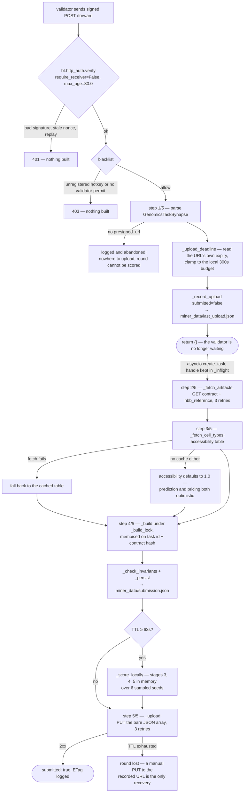
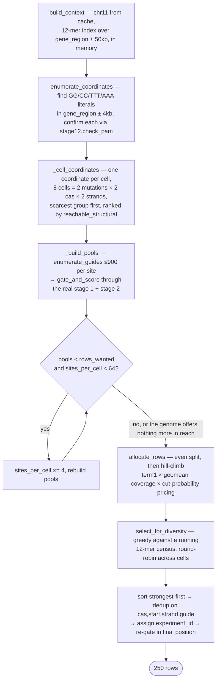

# How the miner answers a validator

One task, one 300-second presigned URL, and no feedback afterwards. The reply to the validator is an
empty acknowledgement — the dataset travels out of band as a `PUT` to the presigned S3 URL that
arrived with the task, and the whole design exists to get 250 rows into that bucket before the URL
expires. A miner that misses the window is indistinguishable from one that was never contacted.

```text
final_score = total_weighted_score × consistency_factor × distribution_fidelity_factor
```

Each factor is a veto: a zero anywhere zeroes the round.

| Factor | Value | Note |
| --- | --- | --- |
| `total_weighted_score` | 327.03 | deterministic function of the design |
| `consistency_factor` | 0.0936 | mostly capped by chromatin accessibility |
| `distribution_fidelity_factor` | 0.8964 | geometric mean of six coverage ratios |
| **`final_score`** | **27.4356** | against a recorded baseline of 21.097 |

Measured on the reference contract — HEK293, 2 mutations, Cas9 + Cas12a, `max_experiments: 250`,
`max_mismatches: 3` — and confirmed against the validator's own `benchmark_submission` to a
difference of `0.00e+00`.

---

## Flow 1 — the request path

The five numbered steps are the ones the miner logs by name, so a live log lines up against this
diagram step for step.



### The steps

| Step | Where | What it does and why |
| --- | --- | --- |
| verify | `niome_subnet/base/miner.py::_setup_routes` | The validator signs the request body with its hotkey. Verification runs before any of the miner's own code; `Miner.blacklist` then checks the caller is registered and holds a validator permit. Two `verify()` defaults have to be overridden or **every** broadcast is rejected — see [below](#the-two-verify-defaults-that-reject-every-task). |
| 1/5 | `Miner.forward` → `_upload_deadline` → `_record_upload` | The URL states its own expiry — `Expires` on a SigV2 URL, `X-Amz-Date` + `X-Amz-Expires` on SigV4 — which beats assuming it was minted the instant it arrived. That read is **clamped to the local 300 s** so a slow clock cannot invent a deadline that has already passed. The target is recorded *before* any work starts, so a lost round can still be PUT by hand while the TTL lasts. |
| — | `asyncio.create_task` | `forward` answers `{}` immediately. The handle is kept in `_inflight` because asyncio holds only a weak reference to a running task — a fire-and-forget call can be collected mid-flight and the round would vanish with no log line. Everything after this runs in worker threads via `asyncio.to_thread`, so `/forward` stays answerable during a build. |
| 2/5 | `Miner._fetch_artifacts` → `_get_json` | Plain unsigned GETs; the presigning is already in the URL. Three retries with linear backoff. Both documents are persisted under `miner_data/` — never `data/`, which belongs to the validation pipeline — which is what lets a restart prewarm its caches and an operator re-score offline. |
| 3/5 | `Miner._fetch_cell_types` | HEK293's accessibility of 0.35 is the largest single term in stage 3's energy, so it sets both the cut probability and the repair mix. The rows stay valid without it; what is at risk is the local prediction's accuracy and the row allocation, which prices each cell's cut probability. |
| 4/5 | `Miner._build` → `design.build_context`, `design.build` | Held under `_build_lock` and memoised on `sha256(task_id + canonical contract)`: every validator broadcasts the same task with its own URL, and the rows are a deterministic function of the contract, so later broadcasts reuse the first build and repeat only the upload. A contract that changes under one task id rebuilds rather than re-uploading rows designed against the old rules. See [Flow 2](#flow-2--inside-the-build). |
| optional | `Miner._score_locally` → `design.score_rows` | Validators compute the score independently and never send it back, so this replica is the only signal available before the next task. It calls stage 4's and stage 5's own functions, so the number it reports is the number they would report. The contract a miner receives carries `seed: 0`, so with no real seed the report is a mean over 6 sampled seeds. Skipped when `remaining_ttl < LOCAL_SCORE_SEEDS * 3 + 45`; a raised exception is logged and swallowed, because a failed prediction must never cost the upload. |
| 5/5 | `Miner._upload` → `_upload_headers` | The URL goes out exactly as received — a re-encoded query string is a `SignatureDoesNotMatch` — and so does the header set. Three retries, each bounded by the remaining TTL. |

### The two `verify()` defaults that reject every task

Both sides of this handshake are configured independently, and the sender is the side a miner cannot
change. `niome_subnet/validator/forward.py::query_miner` calls `bt.http_auth.sign()` with no
`receiver_ss58` and lets `max_age` default, so `bt.http_auth.verify()` needs two overrides:

| Keyword | Default | Set to | Why |
| --- | --- | --- | --- |
| `require_receiver` | `True` | `False` | `sign()` emits `X-Bittensor-Receiver` only when a `receiver_ss58` is passed, and the validator passes none. With the default, verification raises `WrongReceiver: missing X-Bittensor-Receiver` — a 401 — before the signature is even checked. |
| `max_age` | `10.0` | `30.0` | The window is `(our clock) − (the nonce the validator stamped at sign time)`, so it is spent on **host clock skew**, not on latency: `query_miner` signs a fresh nonce immediately before each POST. A miner whose clock runs ten seconds ahead of the validator's rejects every task it is ever sent with `StaleRequest`, and looks unreachable. |

Dropping receiver binding costs nothing here. The payload the validator signed already commits to
method, path, body and nonce, so a captured request cannot be replayed against a different miner's
`/forward` with a different body — only forwarded verbatim to a peer that would verify it identically.
Replay protection itself is unaffected: the nonce store still rejects a second use of the same nonce.

**58 s is the hard ceiling on `max_age`,** not 60. `verify()` refuses `max_age + allowed_skew` in
excess of the nonce store's retention (60 s by default) because a replay inside that gap would be
accepted, and `allowed_skew` defaults to 2 s. That refusal is a `ValueError`, not an `AuthError`, and
it is raised *after* the signature verifies — so exceeding the limit surfaces as a 500 on
otherwise-valid traffic rather than as a 401.

### The header trap in step 5

A SigV2 URL signs Content-Type **as the empty string** (its string-to-sign is
`VERB\nContent-MD5\nContent-Type\nExpires\nresource`), so sending `Content-Type: application/json`
makes S3 hash a different string than the validator did and reject the upload with
`SignatureDoesNotMatch` — which reads like a credentials problem and is in fact this header. V2 URLs
therefore get **no headers at all**. A SigV4 URL covers only the headers named in
`X-Amz-SignedHeaders`, so there the Content-Type is required exactly when it was signed and
forbidden otherwise.

### Started ahead of all of this

A daemon thread (`Miner._prewarm`) loads the ~130 MB chr11 reference at construction, and if a
previous task left its contract on disk, the 12-mer index and the PAM enumeration too. All three
caches are task-independent, so a warm process pays for nothing but the build itself.

---

## Flow 2 — inside the build

`niome_subnet/genomics/design.py`

The miner supplies designs only — guide, coordinate, strand, mutation, Cas system, cell type. Every
biological outcome is rolled by the validator under a seed stamped *after* the broadcast, so nothing
here tries to pick an outcome. Each formula is imported from the validation stages rather than
reimplemented, so the generator cannot drift from the pipeline that judges it.



### What each stage is for

**`build_context`** — chr11 from the process cache, plus a 12-mer index over `gene_region ± 50 kb`,
the same window and the same *k* the validator's off-target check hard-codes. Built in memory rather
than through the pipeline's pickle cache, which would write into `data/`: 0.16 s against 0.05 s for a
cache hit, paid once per process.

**`enumerate_coordinates`** — `check_pam` reads a fixed motif at a fixed offset, so the positions
where one can exist are exactly the occurrences of a 2–3 base literal: `GG`/`CC` for Cas9's NGG,
`TTT`/`AAA` for Cas12a's TTTV once the minus strand is read off the reverse complement. Every hit is
then confirmed through `check_pam` itself, so a change to the gate cannot leave a stale coordinate
behind.

**`_cell_coordinates`** — a coordinate serves exactly one cell: stage 1 dedups on
`(cas, start, strand, guide)` and the mutation is not in that key, so two mutations sharing a
coordinate would collide on any guide they both used. Cells are filled scarcest-group-first, so
Cas12a — whose TTTV PAM is several times rarer than Cas9's NGG — is not left with whatever Cas9
declined.

**`enumerate_guides`** — the contract's three mismatches are the design's only free lever, and they
do three jobs at once:

- a *class flip* moves a base between {G,C} and {A,T} to pull GC to exactly 50%, where `gc_score`
  peaks at 1.0;
- a *within-class swap* (G↔C, A↔T) leaves the count alone and exists only to spell another distinct
  guide;
- any variant whose 12-mer seed still appears in the index is discarded, which is what takes
  `offtarget_factor` from 0.7 to 1.0.

Because every guide returned sits at the same coordinate at the same GC count, stages 1, 2 and 5 see
**one feature vector for the whole set**.

**The growth loop** — one coordinate per cell is the whole point of the design, but it only fills 250
rows if the mismatch budget can spell 250 distinct guides on it. Three free substitutions on a 20-mer
give over a thousand; a contract with `max_mismatches: 0` allows exactly one guide per coordinate,
and a cell would contribute a single row. Measured on `max_mismatches: 0`: 8 rows → 250, term 1 from
7.0 to 233.4.

**`allocate_rows`** — starts from as even a split as capacity allows (the coverage-entropy optimum)
and only moves away when term 1 pays for the loss. Neither term 1 nor the fidelity factor reads the
seed, so the objective is exact and needs no simulation. It also prices each cell's *cut
probability*, since `is_cut`'s normalised error falls as the cut rate rises: Cas9 cuts at 0.95
against Cas12a's 0.87, so the optimum leans to roughly 30 % Cas12a and pays the coverage entropy that
costs. Worth 8.8 % over a coverage-only allocation. No cell is ever emptied — that is the 1e-9 cliff.

**`select_for_diversity`** — collapsing a cell onto one coordinate buys the flat feature matrix, but
it also means a cell's guides differ in at most three positions and share most of their 12-mer
windows, which showed up as `kmer_diversity_entropy_ratio` falling from 0.97 to 0.84 — a 2.4 % haircut
on the whole score through the sixth root. Entropy is maximised when multiplicities are level, so
each guide is picked where its windows are least common. Recovered to 0.985.

**Emit** — `experiment_id` is the key stage 4 merges on and the field `truncate_submission` dedups,
so it has to be unique in *exactly* the array that gets sent. That is why it is assigned last, after
the dedup on `(cas, start, strand, guide)` that stage 1 would otherwise apply silently. The array is
ordered strongest-first so anything a cap ever cuts is the cheapest row rather than an arbitrary one,
and every row is re-gated in final position.

---

## Eight coverage cells

A cell is one (mutation × Cas system × strand) combination. Stage 5 takes a *geometric* mean of six
coverage ratios, so an unoccupied cell multiplies the entire score by roughly 1e-9 — which makes
"every cell holds at least one row" a hard constraint rather than a preference. One coordinate per
cell is also what leaves stage 4's forest looking at eight groups instead of 250 noisy points.

| Mutation | weight | Cas9 + | Cas9 − | Cas12a + | Cas12a − |
| --- | --- | --- | --- | --- | --- |
| `NC_000011.10:g.5226784G>C` | 1.5 | ≥1 row | ≥1 row | ≥1 row | ≥1 row |
| `NC_000011.10:g.5225906G>T` | 0.7 | ≥1 row | ≥1 row | ≥1 row | ≥1 row |

250 rows are distributed across these eight cells by `allocate_rows`. Mutation weight pulls rows
toward `g.5226784G>C`; coverage entropy pulls them level; cut probability pulls them toward Cas9. The
hill climb resolves all three at once.

---

## What each factor actually responds to

### `total_weighted_score` — deterministic, so maximised exactly

Sum over rows of `(0.625·gc_score + 0.375·dist_score) · offtarget_factor · mutation_weight`.

- GC pinned to 50 % → `gc_score` 1.0
- nearest usable PAM to each mutation → `dist_score` ≈ 1.0
- 12-mer seed pushed out of the index → `offtarget_factor` 1.0 on all 250 rows, a flat 1.43× that
  nothing else in the pipeline charges for

### `consistency_factor` — mostly capped

`0.7·max(avg_r2, 0) + 0.3·(1 − avg_nmae)` over a RandomForest fitted to `is_cut`, `is_hdr` and
`indel_length`.

`avg_r2` is negative for any seed-blind design, so the 0.7 term contributes nothing. It turns
positive only through a degeneracy: if no row draws `no_cut`, `is_cut` is a constant column,
`r2_score` returns 1.0 and `normalized_mae` short-circuits to 0. That is **unreachable here** —
`cut_probability` is `base + 0.18·energy` and `energy` is scaled by chromatin accessibility, so at
HEK293's 0.35 a Cas12a row cuts with probability 0.874 at best and 250 rows all cutting has
probability ~1e-10. Chasing it by shrinking the submission loses more on term 1 than the jump is
worth at every row count.

What *is* reachable is the `0.3·(1 − avg_nmae)` term:

- the flat feature matrix took measured r² on `is_hdr`/`indel_length` from −0.25/−0.31 to
  −0.12/−0.11;
- pricing each cell's cut probability in the allocation is worth **+8.8 %**.

Should a contract ever arrive with accessibility above 0.67, `energy` clamps at 1.0 and Cas9's cut
probability reaches its 0.99 ceiling — that is the regime where all 250 rows cutting stops being out
of reach, and it is worth revisiting there.

### `distribution_fidelity_factor` — geometric

Six coverage ratios under a geometric mean, so every one of them is a veto and the sixth root makes
small losses cheap but zeros fatal.

- all eight cells occupied, always
- k-mer diversity ratio 0.84 → 0.985
- rows scored in upload order, because stage 4 shuffles its cross-validation folds from the round
  seed and applies that shuffle in *file* order

### Deliberately absent

Ranking guides by the share of seeds they survive. It was built and measured: with the evaluation
seeds held out of the scanned support the cut rate came out at 0.9285 against 0.9295 for no selection
at all. That is the expected result, not a surprise — every guide in a cell shares one feature vector
and so one cut *probability*, and `experiment_seed` hashes the round seed in with the design, making
a guide's outcomes under two seeds independent draws. Inside the scanned support it did lift the mean
score 2.9 %, but only by +0.76 ± 0.56 paired over 29 seeds, against 36 s of a 300 s upload window. It
was removed rather than left switched off.

---

## The rules that cost rows without raising

Checked by `Miner._check_invariants` before every upload. None of these is reported anywhere
downstream, so a violation shows up only as an unexplained gap between the local prediction and what
a validator pays.

| Violation | Consequence |
| --- | --- |
| blank or non-string `experiment_id` | `truncate_submission` drops the row |
| duplicate `experiment_id` | dropped — and before the dedup existed it fanned a stage-4 merge out instead, which is why very high historical scores on this task are unlikely to be reproducible |
| duplicate `(cas, start, strand, guide)` | stage 1 keeps the first and silently discards the rest |
| rows > `max_experiments` | everything past the cap is cut, hence the strongest-first ordering |

---

## Files and paths

| | |
| --- | --- |
| request handling, fetch, upload | `neurons/miner.py` |
| row generation and local scoring | `niome_subnet/genomics/design.py` |
| miner artifacts | `miner_data/` — override with `NIOME_MINER_DIR` |
| reference genome | shared read-only, `data/chr11.fa` — override with `NIOME_GENOME_PATH` |

The miner writes nothing into `data/`. That directory belongs to the validation pipeline: every stage
there communicates through fixed filenames, and `truncate_submission` rewrites `data/submission.json`
in place. A miner writing `data/contract.json` would silently replace the contract a co-located
validator is scoring against — and since the miner receives an unstamped contract, the validator
would then score every submission under `seed: 0`. Re-scoring a submission with the validator's
`benchmark_submission` therefore takes a deliberate manual copy of three files from `miner_data/`
into `data/`.
